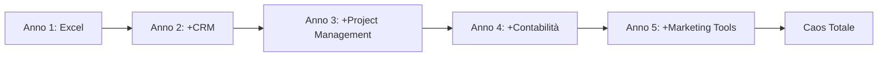

## Il Problema che Ogni PMI Conosce

E se vi capitasse una situazione del genere?
Consulenza, il titolare di un'azienda mostra come gestiscono gli ordini. La scena è familiare a chiunque lavori in una PMI italiana:

- **Excel** per il preventivo
- **Email** per la conferma
- **Trello** per la produzione
- **WhatsApp** per gli aggiornamenti urgenti
- **Un altro Excel** per il magazzino
- **Software del commercialista** per le fatture
- **Google Calendar** per le consegne

"E funziona?"

"Più o meno. Quando Giulia non è malata. Lei sa dove sono tutte le cose."

<Note type="warning">
Se nella vostra azienda c'è quella persona che "sa dove sono tutte le cose", avete un problema di sistema, non di persone.
</Note>

## La Frammentazione degli Strumenti: I Numeri Reali

Secondo le nostre analisi su oltre 50 PMI italiane:

| Metrica | Valore Medio | Impatto |
|---------|--------------|---------|
| Numero di software utilizzati | 8-12 | Alto costo licenze |
| Tempo perso in data entry | 1.5 ore/giorno per persona | -18.75% produttività |
| Errori di allineamento dati | 3-5 al giorno | Decisioni sbagliate |
| Dipendenza da persone chiave | 70% delle aziende | Rischio continuità |

## Come Nasce il Tool-Caos Aziendale

Il problema non è la tecnologia in sé. Trello è ottimo. Excel pure. Il problema nasce quando devi far parlare 10 strumenti che non si sono mai visti prima.

### La Timeline Tipica della Frammentazione



## La Soluzione: Un Gestionale Customizzato

<Note type="info">
Un gestionale customizzato non è un mostro enterprise da 100k euro, ma un sistema sviluppato attorno a COME lavorate voi, non il contrario.
</Note>

### Esempio: Azienda Metalmeccanica

**Situazione iniziale:**
- 35 dipendenti
- Gestionale degli anni 2000 per la produzione
- Excel per tutto il resto
- Post-it. Tanti post-it.

**Soluzione implementata:**
Un sistema unificato che:
- Parte dal preventivo e arriva alla fattura senza interruzioni
- Il magazzino si aggiorna automaticamente con gli ordini di produzione
- I commerciali vedono in tempo reale cosa possono promettere
- La direzione ha dashboard con numeri reali, non "più o meno"

**Risultati:**
- **Tempo di sviluppo:** 3 mesi
- **ROI:** Recuperato in 4 mesi
- **Tempo risparmiato:** 2 ore/giorno per persona
- **Errori ridotti:** -85%

## Architettura Tecnica: Flessibilità è la Chiave

### Stack Tecnologici Supportati

Non importa quale sia la vostra infrastruttura esistente. Un buon gestionale si adatta:

```javascript
// Esempio di architettura modulare in Node.js
const SystemArchitecture = {
  backend: {
    languages: ['Python', 'Node.js', 'Java', '.NET', 'Go'],
    databases: ['PostgreSQL', 'MongoDB', 'MySQL'],
    apis: 'RESTful / GraphQL'
  },
  frontend: {
    frameworks: ['React', 'Vue', 'Angular'],
    mobile: ['React Native', 'Flutter'],
    desktop: ['Electron']
  },
  integrations: {
    existing: 'Via API e webhook',
    cloud: 'AWS, Azure, Google Cloud',
    onPremise: 'Docker, Kubernetes'
  }
};
```

### Principi di Design

1. **Microservizi**: Ogni modulo è indipendente
2. **API-First**: Tutto comunica tramite API standard
3. **Event-Driven**: Aggiornamenti in tempo reale
4. **Scalabile**: Cresce con la vostra azienda

## I Numeri che Contano

<Note type="success">
Un gestionale fatto bene vi fa risparmiare mediamente 1-2 ore al giorno per persona su task amministrativi.
</Note>

### Analisi Costi-Benefici

Per un'azienda di 20 persone:

| Voce | Costo Annuale | Note |
|------|---------------|------|
| **10 licenze software** | €15,000-25,000 | Variabile per dimensione |
| **Tempo perso (1.5h/giorno x 20 persone)** | €150,000 | Calcolato su costo orario medio |
| **Errori e inefficienze** | €20,000-50,000 | Stima conservativa |
| **Totale spreco annuale** | €185,000-225,000 | |
| **Costo gestionale custom** | €40,000-80,000 | Una tantum + manutenzione |
| **ROI primo anno** | 150-280% | |

## Implementazione: Il Processo Reale

### Fase 1: Analisi (2-3 settimane)
- Mappatura processi esistenti
- Identificazione criticità
- Definizione requisiti

### Fase 2: Prototipazione (3-4 settimane)
```javascript
// Esempio di prototipo rapido con Express.js
const prototype = {
  modules: ['ordini', 'magazzino', 'fatturazione'],
  interfaces: ['web', 'mobile'],
  validations: userFeedback => improvements
};
```

### Fase 3: Sviluppo Iterativo (8-10 settimane)
- Sprint di 2 settimane
- Feedback continuo
- Adjustments in corso d'opera

### Fase 4: Deployment e Training (2 settimane)
- Migrazione dati
- Formazione personalizzata
- Supporto on-site

## Le Domande Difficili (e le Risposte Oneste)

### "Saremo legati a voi per sempre?"

No, se facciamo le cose per bene:
- Documentazione completa e chiara
- Codice standard e mantenibile
- Tecnologie open source quando possibile
- Formazione del vostro team IT

### "E se cambiamo idea o cresciamo?"

Un buon gestionale è modulare:
- Aggiungi funzionalità quando servono
- Scala con il business
- Si integra con nuovi strumenti
- Evolve senza ripartire da zero

### "Cosa succede se qualcosa va storto?"

```javascript
// Sistema di backup e recovery integrato
const DisasterRecovery = {
  backups: 'Automatici ogni 4 ore',
  redundancy: 'Multi-server',
  rollback: 'Possibile in qualsiasi momento',
  sla: '99.9% uptime garantito'
};
```

## Best Practices per il Successo

<Note type="info">
Sviluppare un gestionale custom non è solo questione di codice. È capire davvero come lavorate, quali sono i vostri processi, cosa funziona e cosa no.
</Note>

### Cosa Fare ✅
1. Coinvolgere tutto il team fin dall'inizio
2. Partire con un MVP e crescere
3. Documentare tutto
4. Prevedere formazione continua
5. Monitorare metriche di successo

### Cosa NON Fare ❌
1. Replicare i processi inefficienti in digitale
2. Ignorare il feedback degli utenti
3. Sottovalutare la resistenza al cambiamento
4. Puntare alla perfezione dal day 1
5. Dimenticare la manutenzione

## Conclusioni

La trasformazione da 14 software a 1 gestionale unificato non è una magia, è un lavoro di squadra dove voi mettete la conoscenza del business, noi la capacità di tradurla in codice.

A volte scopriamo che il problema non è il software, ma un processo che andrebbe ripensato. E va bene così. Meglio accorgersene prima che dopo.

**Il risultato?** Un'azienda che dedica il tempo a crescere, non a far parlare software che non si conoscono.
